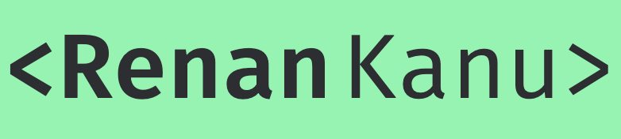

  

<h1>Meu Portfolio</h1>

  

 
 

  
Este é meu portfolio, criei ele para o estudo das tecnologias: NextJS, TypeScript e Styled Components, ainda sou novo no mundo do Front End Web. Estarei melhorando constantemente esse portfolio conforme for aprendendo mais com as tecnologias citadas. O projeto está hospedado na <a href="http://vercel.com/">Vercel</a>. Aqui está o link do meu portfolio -> <a href="https://www.renankanu.com.br">renankanu</a>

## Construído com
Algumas coisas que utilizei no projeto
* [NextJs](https://nextjs.org/)
* [TypeScript](https://www.typescriptlang.org/)
* [Styled Components](https://styled-components.com/)
* [AOS](https://michalsnik.github.io/aos/)

## Contribuindo

As contribuições são o que tornam a comunidade de código aberto um lugar incrível para aprender, inspirar e criar.

1. Dê um Fork
2. Crie sua Feature Branch (`git checkout -b feature/AmazingFeature`)
3. Dê um Commit nas suas alterações  (`git commit -m 'Add some AmazingFeature'`)
4. Dê um Push na Branch (`git push origin feature/AmazingFeature`)
5. Abra um Pull Request

## Licença

Todo o código neste repo é licenciado pelo MIT.
